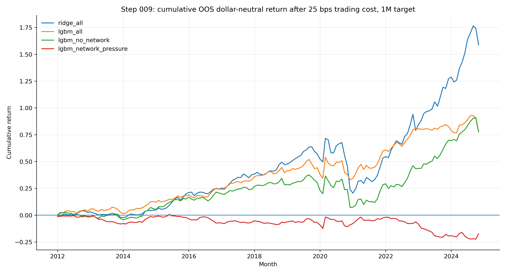
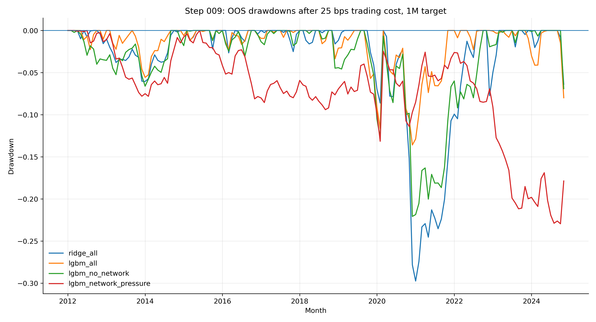
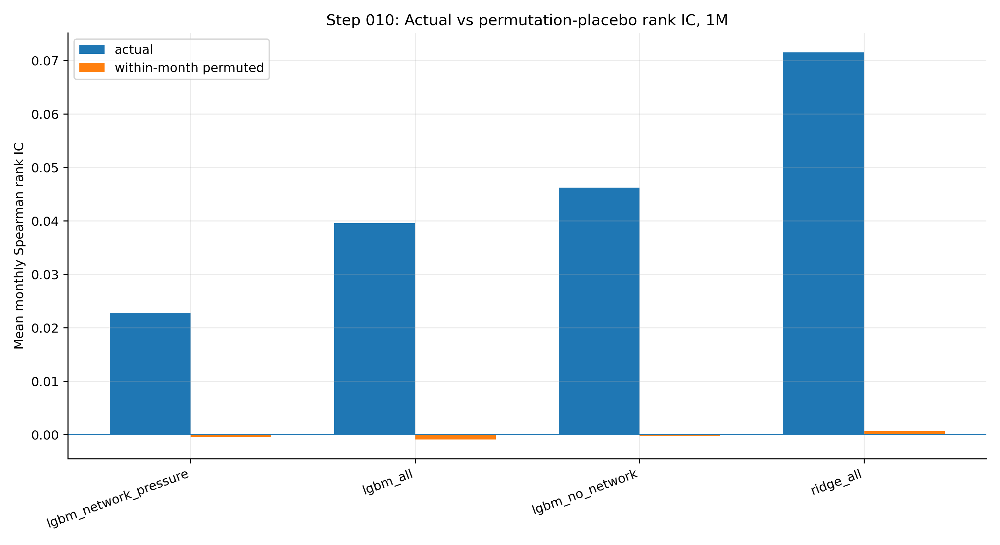
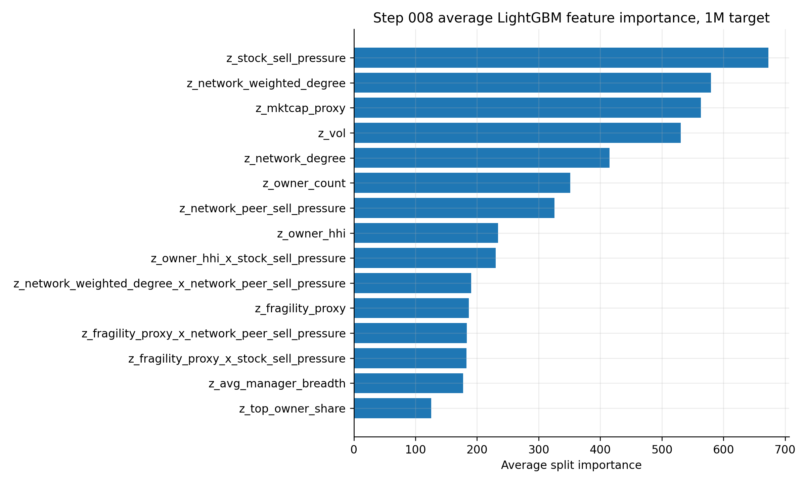
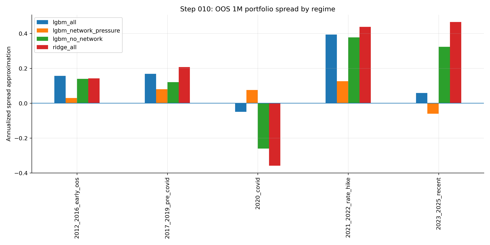

# Filing-Date-Clean Ownership Network Fragility

Research-grade asset-pricing pipeline for testing whether filing-date-clean institutional ownership networks forecast stock returns, downside risk, and crowding-driven spillover pressure.

[](https://github.com/NimaTaheri1378/ownership-network-fragility/actions/workflows/public_repo_audit.yml)




## Executive summary

This repository is the public-safe release of a full-stack empirical asset-pricing project. The private research pipeline resolves Form 13F holdings at public filing-date availability, maps disclosed institutional positions to a CRSP common-stock universe, constructs a dynamic common-ownership network, engineers fragility and spillover-pressure features, and evaluates whether those signals survive decile tests, Fama-MacBeth regressions, out-of-sample machine learning, transaction costs, factor attribution, and robustness diagnostics.

The final result is intentionally framed as a **research candidate**, not a deployed or live trading system. The public repo contains code, documentation, aggregate result tables, figures, dashboards, and tests. Raw WRDS/vendor data, local Parquet panels, protected caches, credentials, and cluster logs are excluded.

## Research question

Do stocks exposed to crowded institutional capital and common-ownership spillover pressure earn different future returns after signals are formed only when the underlying 13F filings are publicly available?

The economic intuition is that stocks are not only exposed to their own fundamentals. They are also exposed to the portfolio constraints, crowding, and correlated rebalancing of the institutional managers who own them. A shock to one part of a crowded portfolio can propagate through common owners into other names, especially where ownership is concentrated, capital is fragile, or liquidity is thin.

## Headline result

| Item | Public release value |
|---|---:|
| Selected research candidate | `ridge_all`, 1-month forward return |
| Portfolio construction | dollar-neutral top-minus-bottom decile |
| Cost assumption | 25 bps one-way turnover cost |
| Full panel | 1,509,894 stock-months |
| Panel coverage | 303 months, 12,639 stocks |
| OOS prediction rows | 4,500,728 |
| Annualized net return | 7.88% |
| Sharpe approximation | 0.795 |
| Newey-West t-stat | 2.65 |
| Cumulative return | 158.75% |
| Max drawdown | -29.75% |
| Factor annualized alpha | 8.47% |
| Factor alpha HAC t-stat | 3.05 |
| Decision status | research candidate; not production/live trading |

The statistical evidence is economically interesting, but the repo is deliberately conservative about interpretation. The main value is disciplined point-in-time data engineering, leakage control, model comparison, cost-aware validation, factor attribution, public-release hygiene, and honest research judgment.

## Visual results

| Portfolio validation | Robustness and attribution |
|---|---|
|  |  |
| **Net cumulative performance.** The headline ridge model remains positive after 25 bps trading costs. | **Factor attribution.** The headline model retains positive annualized alpha after standard factor controls. |
|  |  |
| **Drawdown profile.** The strategy has meaningful drawdowns, so it is a research candidate rather than a production claim. | **Placebo discipline.** Actual rank IC is far away from deterministic within-month return permutations. |

| Signal diagnostics | Model diagnostics |
|---|---|
|  |  |
| **Baseline signal tests.** Ownership concentration, fragility, sell pressure, and network features are tested before ML. | **Model explainability.** OOS LightGBM importance highlights which ownership-network and control variables matter. |
|  |  |
| **Formal inference.** Monthly Fama-MacBeth regressions provide transparent asset-pricing-style evidence. | **Regime robustness.** OOS spread behavior is summarized across market regimes. |

## Pipeline architecture

```mermaid
flowchart LR
    A[WRDS schema discovery] --> B[Public filing-date 13F resolution]
    B --> C[CRSP common-stock mapping]
    C --> D[Manager-stock sparse matrix]
    D --> E[Common-ownership graph]
    E --> F[Fragility and spillover features]
    F --> G[Deciles and rank IC]
    G --> H[Fama-MacBeth inference]
    H --> I[Expanding-window OOS ML]
    I --> J[Cost-aware portfolio validation]
    J --> K[Factor attribution and robustness]
    K --> L[Public-safe release]
```



## What is public here

| Component | Included? | Notes |
|---|---:|---|
| Research code structure | Yes | Package layout, scripts, configs, tests, documentation |
| Aggregate result tables | Yes | Public-safe summaries only; no row-level vendor panels |
| Static figures | Yes | Rendered aggregate research figures |
| Interactive dashboards | Yes | HTML dashboards built from aggregate summaries |
| Tests and CI audit | Yes | Smoke tests, unit tests, public-release checks |
| Raw WRDS / CRSP / Compustat / 13F data | No | Users must provide their own licensed access |
| Local Parquet panels and caches | No | Excluded by `.gitignore` and audit policy |
| Credentials, cluster logs, private schema contracts | No | Excluded and scanned before release |

## Public aggregate tables

The public-safe aggregate tables are in:

```text
docs/assets/tables/
```

Key files:

```text
006_rank_ic_summary_20260529T225240Z.csv
006_spread_summary_20260529T225240Z.csv
007_fmb_coefficient_summary_20260529T231258Z.csv
008_oos_model_summary_20260529T232844Z.csv
009_portfolio_performance_summary_20260529T235209Z.csv
009_factor_attribution_20260529T235209Z.csv
010_robustness_scorecard_20260530T001155Z.csv
011_headline_summary_20260530T005012Z.csv
```

## Quickstart

The public repository does not include proprietary data. It is intended to install, lint, test, and document the research code and public aggregate release.

```bash
mamba env create -f environment.yml
conda activate ml_core
pip install -e .

make smoke
make test
python scripts/011_public_repo_audit.py --project-root .
mkdocs build
```

If the `ml_core` environment already exists:

```bash
conda activate ml_core
pip install -e .
make smoke
make test
```

## Repository map

```text
ownership-network-fragility/
├── README.md
├── DATA_ACCESS.md
├── configs/
│   ├── data.yaml
│   ├── features.yaml
│   └── model_lgbm.yaml
├── docs/
│   ├── assets/
│   │   ├── figures/
│   │   ├── interactive/
│   │   └── tables/
│   ├── methodology.md
│   ├── results.md
│   ├── robustness.md
│   ├── reproducibility.md
│   └── model_card.md
├── scripts/
│   ├── 001_smoke.py
│   ├── 005_full_panel_network_scale.py
│   ├── 006_baseline_signal_tests.py
│   ├── 007_formal_econometrics.py
│   ├── 008_oos_ml_signal_models.py
│   ├── 009_portfolio_costs_and_factor_attribution.py
│   └── 010_robustness_suite.py
├── src/
│   └── ownership_fragility/
├── tests/
└── .github/workflows/
```

## Skills demonstrated

| Area | What this project demonstrates |
|---|---|
| Data engineering | WRDS-scale schema discovery, point-in-time joins, protected local caches |
| Market microstructure hygiene | filing-date availability, amendment awareness, CRSP common-stock mapping |
| Network science | sparse manager-stock matrices and stock-stock common-ownership graph features |
| Empirical asset pricing | decile sorts, rank IC, Fama-MacBeth regressions, Newey-West inference |
| Financial ML | expanding-window OOS validation, embargoes, LightGBM, feature importance |
| Backtesting | turnover-aware long/short portfolios, cost frontiers, drawdown diagnostics |
| Factor attribution | factor alpha, HAC t-stats, robustness scorecards |
| Release engineering | public-safe GitHub packaging, CI audit, data policy, documentation site |

## Data policy

This public repository intentionally excludes raw WRDS/vendor data, credentials, local cluster logs, protected Parquet caches, and private schema contracts. Users need their own WRDS, CRSP, Compustat, and 13F entitlements. See [`DATA_ACCESS.md`](DATA_ACCESS.md).

## Status and next credibility checks

This is a **research candidate**, not a deployed strategy. Before any real capital deployment, the next credibility checks would be:

1. independent replication on a separately rebuilt WRDS environment;
2. deeper execution-cost modeling with liquidity and capacity constraints;
3. stricter sector, beta, and dollar-neutral portfolio construction variants;
4. additional placebo networks and filing-date alignment stress tests;
5. live paper-trading with frozen code and pre-registered decision rules.

## License

Code is released under the MIT License. Figures and documentation are intended for public research presentation only. Third-party data products are not redistributed.
