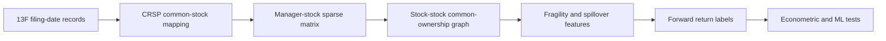

# Methodology

The project studies whether public, filing-date-clean institutional common-ownership networks forecast future stock returns and downside pressure.

## Timing discipline

Form 13F holdings are observed only after public filing availability. The pipeline uses the public filing date, not quarter-end, to decide when a manager-stock position can enter the signal panel. Amendments and duplicates are handled before the monthly signal panel is formed.

## Network construction

For each month, the pipeline forms a sparse manager-stock matrix from the most recent publicly available holdings. Stock-level ownership features include owner count, owner HHI, top-owner share, manager breadth, disclosed sell pressure, network degree, weighted network degree, and network peer sell pressure.

## Validation ladder

1. Pilot extraction and quality audit.
2. Full panel and network construction.
3. Baseline deciles and rank ICs.
4. Fama-MacBeth regressions with Newey-West inference.
5. Expanding-window OOS ML with embargoes.
6. Cost-adjusted portfolios and factor attribution.
7. Regime, stratum, network-incremental, and placebo robustness.
