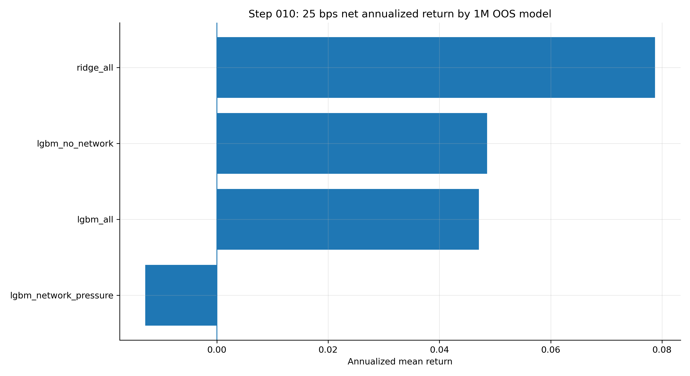
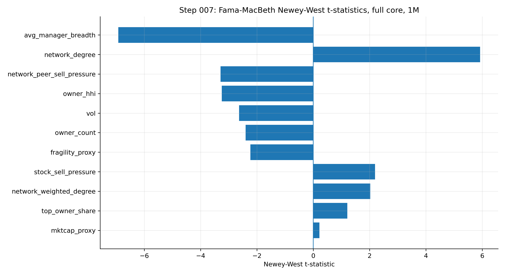
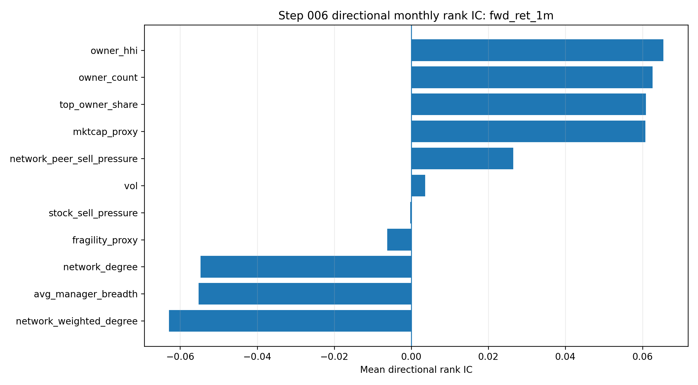
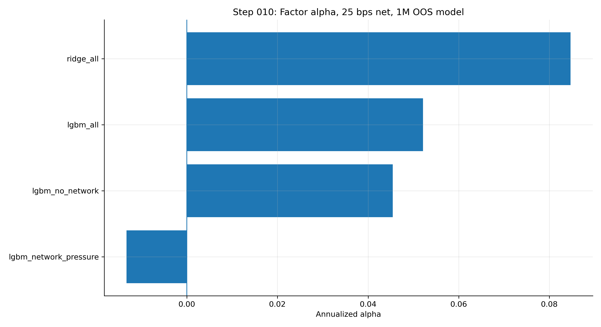

# Results

## Headline scorecard

| model | rank IC | IC t | gross HML | net25 return | net25 Sharpe | factor alpha | alpha t |
| --- | --- | --- | --- | --- | --- | --- | --- |
| ridge_all | 0.0715 | 9.72 | 21.25% | 7.88% | 0.795 | 8.47% | 3.05 |
| lgbm_all | 0.0395 | 7.39 | 16.58% | 4.71% | 0.647 | 5.21% | 2.97 |
| lgbm_no_network | 0.0462 | 8.69 | 16.81% | 4.86% | 0.543 | 4.54% | 1.92 |
| lgbm_network_pressure | 0.0228 | 2.80 | 4.65% | -1.29% | -0.209 | -1.33% | -0.80 |

## Net 25 bps portfolio comparison

| model | target | annualized_mean_return | sharpe_approx | nw_t_mean | cumulative_return | max_drawdown | hit_rate |
| --- | --- | --- | --- | --- | --- | --- | --- |
| ridge_all | fwd_ret_1m | 0.0787567894345814 | 0.7945950812974858 | 2.653758475299275 | 1.5874631880987806 | -0.297516278612194 | 0.6516129032258065 |
| lgbm_all | fwd_ret_1m | 0.0470947189386871 | 0.6472684295100236 | 2.971911876932307 | 0.7752264137035632 | -0.1359749797156771 | 0.632258064516129 |
| lgbm_no_network | fwd_ret_1m | 0.0485509600524526 | 0.5434605831042161 | 2.148011127741129 | 0.7762565630998566 | -0.2208242366654295 | 0.6129032258064516 |
| lgbm_network_pressure | fwd_ret_1m | -0.0128839766253137 | -0.2093380638279479 | -0.8932061949072518 | -0.1732456947918267 | -0.2295313836385347 | 0.432258064516129 |

## Selected figures

### Net 25 bps model returns

### Fama-MacBeth t-statistics

### Baseline rank IC

### Factor alpha

## Interpretation

The strongest linear model is stable and economically meaningful after transaction costs and factor controls. LightGBM variants produce positive OOS rank ICs and net portfolio performance, but the final scorecard identifies the simple ridge specification as the cleanest headline model in this run.
